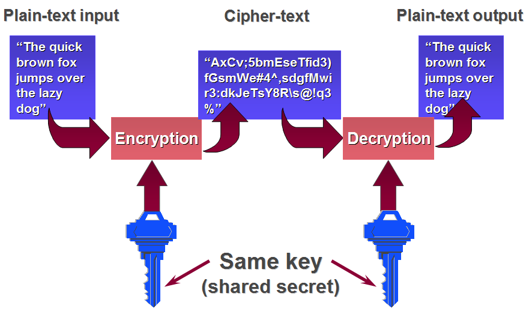
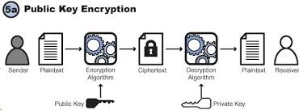

## Questions to ask after each readme

### Encoding vs encryption vs hashing readme

#### Question 1. Draw the symettric and asymmetric encryption flow on the whiteboard and explain it.

Symmetric encryption flow  



Asymmetric encryption flow  



#### Question 2. Explain what is a dictionary attack, a brute force attack, and what are lookup tables.

  - see definitions in the readme

#### Question 3. Why salt factors can make a hacker's life more difficult. Why should we use random SALT factors?


Lookup tables are only effective because each password is hahed the same way. If two users have the same password, their hashed passwords are the same too.

- Salt reuse

  It is a mistake to use the same salt for for every password. (It doesn't matter whether is hard-coded or randomly generated once.). It is an ineffective approach since when two users have the same passwod, they'll still have exactly the same hashed password.

- Random salt, different for every password  

  - We prevent lookup attacks by randomizing the hash, even if the same password is hashed twice, the hashes don't match. It can be done by appending or prepending a random string, the salt factor to the password before hasing.

  - to check whether the passwords match (when the user logs in), we need the salt factor, it should be stored in the database along with the hashed password.

  - The salt doesn't need to be a secret!! Just by using randomized hashes lookup tables will become ineffective.

### What are JSON web token and why we use them

#### Question 1. When and why we use JWTs?
  - safe way to represent and transmit a set of inromation between two parties
  - self-contained: payload has all the necessary information eg.:
  ```
  let payload = {
      'user': {
          'username': body.login,
          'img_url': body.avatar_url,
          'user_id': body.id
        },
      'accessToken': token.access_token
    };
  ```
  - easy to pass them around in:
      - http headers
      - post parameters
      - query parameters in urls
  - most common use is for authentication


#### Question 2. Draw the JWT flow on the whiteboard and explain it


### The structure of JSON web tokens

#### Question 1. Name the three parts of a JWT? Which parts are encoded,signed, or encrypted?
  - header -- encoded
  - payload -- encoded
  - signature -- encoded and signed  

#### Question 2. Imagine you authenticate your users with github/facebook/linkedin or any other social media API that uses auth. Draw the flow how you get the user details (Please rephrase this question, i didn't manage to word it better :( )

- basic auth flow (I think it is good to revise it) -- they have the access token
- make a post request (to get the user details) to the endpoint with the user login
- you can save the user data in the payload
```
let payload = {
    'user': {
        'username': body.login,
        'img_url': body.avatar_url,
        'user_id': body.id
      },
    'accessToken': token.access_token
  };
```
- make the JWT

### JWT and hapi-auth-jwt2 example

#### Question 1. Where can you store JWTs? Discuss the advantages and disadvantages of these options?

  - store it in a cookie (adv: client can't read it, disadv: the access stoken is still not protected)
  - store it on the server, save it into a database (adv: hidden from the user disadv: requires more work to implement it )
  - encrypt it (adv: the access token is safe and hidden, disadv: requires more work to implement it)
